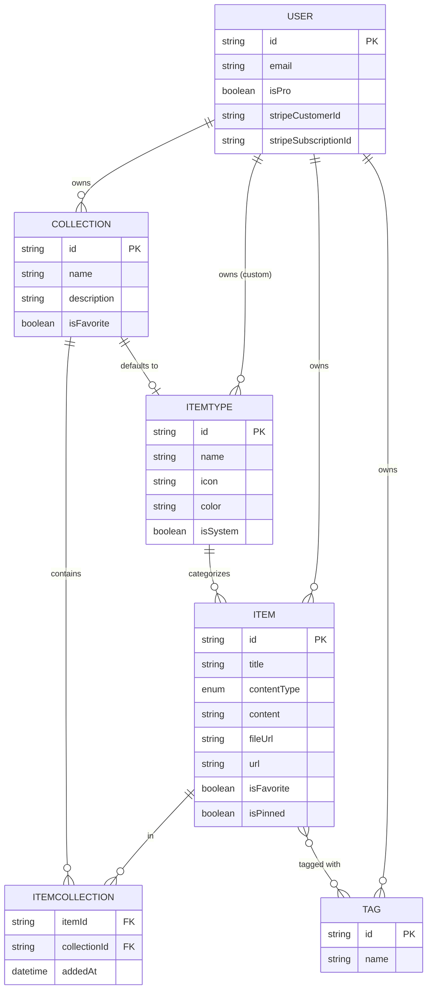

# DevStash — Project Overview

> One fast, searchable, AI-enhanced hub for all developer knowledge and resources.

---

## 1. Problem

Developers keep their essentials scattered across too many places:

- **Code snippets** in VS Code or Notion
- **AI prompts** in chat histories
- **Context files** buried inside projects
- **Useful links** in browser bookmarks
- **Docs** in random folders
- **Commands** in loose `.txt` files
- **Project templates** in GitHub gists
- **Terminal commands** in bash history

The result is constant context switching, lost knowledge, and inconsistent workflows. **DevStash consolidates all of it into a single, fast, searchable hub** — with optional AI enhancement on top.

---

## 2. Target Users

| User | Primary Need |
| --- | --- |
| **Everyday Developer** | Quickly grab snippets, prompts, commands, and links. |
| **AI-first Developer** | Save prompts, contexts, workflows, and system messages. |
| **Content Creator / Educator** | Store code blocks, explanations, and course notes. |
| **Full-stack Builder** | Collect patterns, boilerplates, and API examples. |

---

## 3. Features

### A. Items & Item Types

Every piece of content is an **Item**, and each item has a **type**. Users can eventually create custom types, but the app ships with these immutable **system types**:

| Type | Category | Notes |
| --- | --- | --- |
| `snippet` | text | |
| `prompt` | text | |
| `note` | text | |
| `command` | text | |
| `link` | url | |
| `file` | file | **Pro only** |
| `image` | file | **Pro only** |

A type resolves to one of three **content categories**: `text` (snippet, note, prompt, command), `url` (link), or `file` (file, image).

- Item lists are routed by type slug, e.g. `/items/snippets`, `/items/commands`.
- Items should be **fast to create and access** via a quick **drawer** UI.

### B. Collections

Users can create **Collections** that hold items of any type. An item can belong to **multiple collections** at once.

> Example: a single React snippet could live in both *"React Patterns"* and *"Interview Prep"*.

Sample collections:

- **React Patterns** — snippets, notes
- **Context Files** — files
- **Python Snippets** — snippets

### C. Search

Powerful search across:

- Content
- Tags
- Titles
- Types

### D. Authentication

- Email / password
- GitHub OAuth sign-in

### E. Other Features

- Collection and item **favorites**
- **Pin** items to the top
- **Recently used** view
- Import code from a file
- **Markdown editor** for text types
- File upload for file types (file / image)
- Export data in multiple formats
- **Dark mode** (light mode is default)
- Add / remove items to/from multiple collections
- View which collections an item belongs to

### F. AI Features (Pro only)

- AI auto-tag suggestions
- AI summaries
- "Explain This Code"
- Prompt optimizer

---

## 4. Data Model

> The mockup below has been formalized into Prisma models. Field choices are reasonable defaults — see the **Modeling notes** after the schema for the decisions worth revisiting.

### 4.1 Entity Relationship Diagram



### 4.2 Prisma Schema

```prisma
// ─── Enums ──────────────────────────────────────────────

enum ContentType {
  TEXT
  FILE
}

// ─── Auth (NextAuth v5) ─────────────────────────────────

model User {
  id            String    @id @default(cuid())
  name          String?
  email         String    @unique
  emailVerified DateTime?
  image         String?

  // Billing
  isPro                Boolean @default(false)
  stripeCustomerId     String? @unique
  stripeSubscriptionId String? @unique

  // Relations
  accounts    Account[]
  sessions    Session[]
  items       Item[]
  itemTypes   ItemType[]
  collections Collection[]
  tags        Tag[]

  createdAt DateTime @default(now())
  updatedAt DateTime @updatedAt
}

// Standard NextAuth models (Account, Session, VerificationToken)
// are omitted here for brevity — generate them from the
// official @auth/prisma-adapter schema.

// ─── Core Domain ────────────────────────────────────────

model Item {
  id          String      @id @default(cuid())
  title       String
  contentType ContentType @default(TEXT)

  // Content (one of these is populated based on contentType)
  content  String? // text content, null for files
  fileUrl  String? // R2 URL, null for text
  fileName String? // original filename, null for text
  fileSize Int? // bytes, null for text
  url      String? // populated for `link` types

  description String?
  language    String? // optional, for syntax highlighting
  isFavorite  Boolean @default(false)
  isPinned    Boolean @default(false)

  // Relations
  userId     String
  user       User             @relation(fields: [userId], references: [id], onDelete: Cascade)
  itemTypeId String
  itemType   ItemType         @relation(fields: [itemTypeId], references: [id])
  tags       Tag[]            @relation("ItemTags")
  collections ItemCollection[]

  createdAt DateTime @default(now())
  updatedAt DateTime @updatedAt

  @@index([userId])
  @@index([itemTypeId])
}

model ItemType {
  id       String  @id @default(cuid())
  name     String
  icon     String // lucide-react icon name, e.g. "Code"
  color    String // hex value, e.g. "#3b82f6"
  isSystem Boolean @default(false)

  // null for system types; set for user-created custom types
  userId String?
  user   User?   @relation(fields: [userId], references: [id], onDelete: Cascade)

  items               Item[]
  collectionsDefault  Collection[] @relation("CollectionDefaultType")

  @@index([userId])
}

model Collection {
  id          String  @id @default(cuid())
  name        String
  description String?
  isFavorite  Boolean @default(false)

  // Default type for new items added to an empty collection
  defaultTypeId String?
  defaultType   ItemType? @relation("CollectionDefaultType", fields: [defaultTypeId], references: [id])

  userId String
  user   User   @relation(fields: [userId], references: [id], onDelete: Cascade)
  items  ItemCollection[]

  createdAt DateTime @default(now())
  updatedAt DateTime @updatedAt

  @@index([userId])
}

// Explicit join table so we can track `addedAt`
model ItemCollection {
  itemId       String
  collectionId String
  addedAt      DateTime @default(now())

  item       Item       @relation(fields: [itemId], references: [id], onDelete: Cascade)
  collection Collection @relation(fields: [collectionId], references: [id], onDelete: Cascade)

  @@id([itemId, collectionId])
  @@index([collectionId])
}

model Tag {
  id   String @id @default(cuid())
  name String

  userId String
  user   User   @relation(fields: [userId], references: [id], onDelete: Cascade)
  items  Item[] @relation("ItemTags")

  // Tag names are unique per user, not globally
  @@unique([userId, name])
  @@index([userId])
}
```

### 4.3 Modeling Notes

- **`ItemCollection` is an explicit join model** (not Prisma's implicit `@relation` many-to-many) specifically so it can carry `addedAt`. This is what powers "recently added to collection" ordering.
- **Tags are scoped per user** via `@@unique([userId, name])`. The original mockup left `Tag` global (just `id`, `name`); per-user scoping avoids one user's tags polluting another's autocomplete. Revisit if you ever want shared/public tags.
- **`Item ↔ Tag` uses an implicit many-to-many** (`@relation("ItemTags")`) since there's no extra metadata to store on that link. If you later want per-tag ordering or "tagged at" timestamps, promote it to an explicit join model like `ItemCollection`.
- **`ItemType.userId` is nullable**: `null` = system type, set = user's custom type. System types should be seeded once and protected from edits/deletes in application logic.
- **`contentType` enum** distinguishes how an item stores data (text vs. file). The narrower *system type* (snippet/prompt/note/etc.) lives on `ItemType` — keep these two concepts separate.
- **`onDelete: Cascade`** is set on user-owned relations so deleting a user cleans up their data. Note that `Item.itemType` intentionally has **no** cascade, to avoid deleting items when a custom type is removed — decide your desired behavior there.

> **Migration policy:** Never use `prisma db push` or edit the database structure directly. All schema changes go through migrations — run in dev first, then prod.

---

## 5. Tech Stack

### Framework

- **Next.js 16 / React 19** — SSR pages with dynamic components
- **API routes** for backend needs (storing items, file uploads, AI calls)
- One codebase / repo for less overhead
- **TypeScript** for type safety

### Database & ORM

- **Neon PostgreSQL** (cloud)
- **Prisma 7** (latest — fetch current docs before building)
- **Redis** for caching *(maybe / later)*

### File Storage

- **Cloudflare R2** for file uploads

### Authentication

- **NextAuth v5** — email/password + GitHub OAuth

### AI Integration

- **OpenAI** — `gpt-5-nano` model

### Styling / UI

- **Tailwind CSS v4**
- **shadcn/ui** components

---

## 6. Monetization (Freemium)

> During development, **all users get full access**. The plan gating below should be scaffolded now but enforced later.

| | **Free** | **Pro** — $8/mo or $72/yr |
| --- | --- | --- |
| Items | 50 total | Unlimited |
| Collections | 3 | Unlimited |
| System types | All except file/image | All |
| File & image uploads | ❌ | ✅ |
| Search | Basic | Basic |
| Custom types | ❌ | ✅ *(later)* |
| AI auto-tagging | ❌ | ✅ |
| AI code explanation | ❌ | ✅ |
| AI prompt optimizer | ❌ | ✅ |
| Export data (JSON / ZIP) | ❌ | ✅ |
| Support | Standard | Priority |

---

## 7. UI / UX

### General

- Modern, minimal, developer-focused
- **Light mode by default**, Dark mode optional
- Clean typography, generous whitespace
- Subtle borders and shadows
- Syntax highlighting for code blocks
- **References:** Notion, Linear, Raycast

### Layout

- **Sidebar + main content**, collapsible sidebar
- **Sidebar:** item types with links to their lists (Snippets, Commands, etc.) + latest collections
- **Main:** grid of color-coded collection cards (background color reflects the item type the collection holds most of). Items render as cards beneath collections, color-coded by **border** color.
- Individual items open in a **quick-access drawer**

### Type Colors & Icons

> Icons reference [lucide-react](https://lucide.dev/icons/).

| Type | Color | Icon |
| --- | --- | --- |
| 🔵 Snippet | `#3b82f6` (blue) | `Code` |
| 🟣 Prompt | `#8b5cf6` (purple) | `Sparkles` |
| 🟠 Command | `#f97316` (orange) | `Terminal` |
| 🟡 Note | `#fde047` (yellow) | `StickyNote` |
| ⚪ File | `#6b7280` (gray) | `File` |
| 🩷 Image | `#ec4899` (pink) | `Image` |
| 🟢 Link | `#10b981` (emerald) | `Link` |

### Responsive

- Desktop-first, but fully usable on mobile
- Sidebar collapses into a drawer on mobile

### Micro-interactions

- Smooth transitions
- Hover states on cards
- Toast notifications for actions
- Loading skeletons

---

## 8. Reference Links

- [Next.js Docs](https://nextjs.org/docs)
- [Prisma Docs](https://www.prisma.io/docs)
- [Neon Postgres](https://neon.tech/docs)
- [NextAuth v5](https://authjs.dev)
- [Cloudflare R2](https://developers.cloudflare.com/r2/)
- [Tailwind CSS v4](https://tailwindcss.com/docs)
- [shadcn/ui](https://ui.shadcn.com)
- [lucide-react Icons](https://lucide.dev/icons/)
- [OpenAI API](https://platform.openai.com/docs)

# Design References

### Screenshots

Refer to the screenshots below as a dashboard UI.  It does not have to be exact.  Use it as a reference.

@context/screenshots/dashboard-ui-main.png
@context/screenshots/dashboard-ui-drawer.png